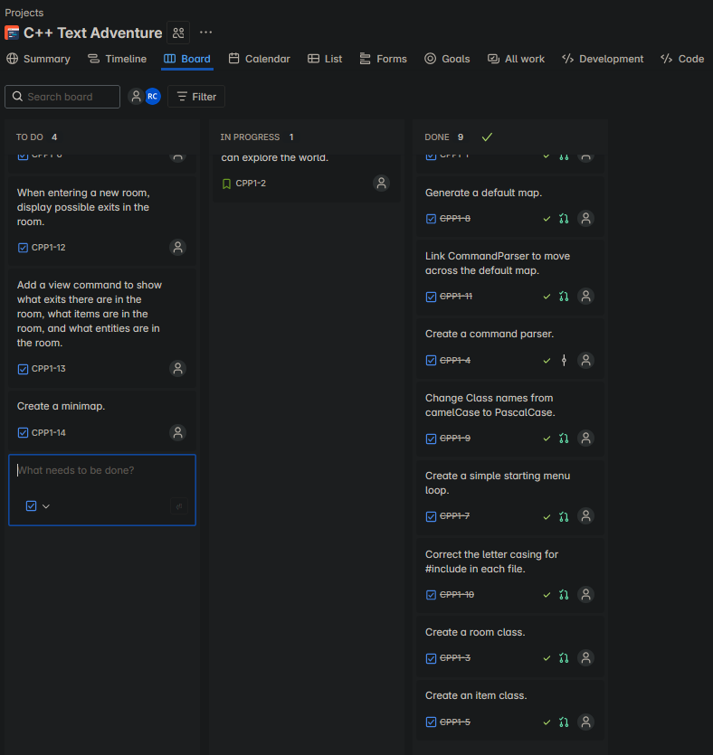

# C++ Text Adventure Game
A text adventure game coded in C++ and played through a CLI (Command Line Interface).

## Motivation
I really enjoyed my text adventure coursework in university but didn't have enough time to fully create it in a way that I really wanted. This is my first personal project which doesn't include all my university projects. This was a great opportunity for me to improve my C++ and use a Kanban Project Management methodology on Jira.

## Features
- Statically generated map of 11 rooms
- Commands "go north, go south, go west, go east" to move to different rooms
- Dynamic minimap that updates every time you move to a new room

## Upcoming features
- NPCs
- Items
- Win condition
- Unit tests
- Detailed Documentation
- Scene manager for Main Menu and Game

## Potential features
- Save and load states
- Randomly generated map per run
- Turn-based combat with enemies
- Use CMake
- Cutscenes

## Skills demonstrated
- C++
- Kanban methodology with Jira 
- Git
- Branch management with Jira for features

Inspired by one of my courseworks and the use of Jira was inspired by https://github.com/Nazar2347/Snake!

## How to run
### Windows (MSYS2 / MinGW)
1. Install MSYS2: https://www.msys2.org/
2. Open MSYS2 MinGW 64-bit terminal
3. Install compiler and CMake:
   pacman -Syu
   pacman -S mingw-w64-x86_64-gcc
   pacman -S mingw-w64-x86_64-cmake
4. Clone and build:
   git clone <repo-url>
   cd text-adventure
   mkdir build
   cd build
   cmake -G "MinGW Makefiles" ..
   cmake --build .
5. Run:
   ./TextAdventure.exe

### macOS
1. Install Xcode command line tools:
   xcode-select --install
2. Install CMake (Homebrew recommended):
   brew install cmake
3. Clone and build:
   git clone <repo-url>
   cd text-adventure
   mkdir build
   cd build
   cmake ..
   cmake --build .
4. Run:
   ./TextAdventure

### Linux (Ubuntu/Debian)
1. Install compiler and CMake:
   sudo apt update
   sudo apt install build-essential cmake git
2. Clone and build:
   git clone <repo-url>
   cd text-adventure
   mkdir build
   cd build
   cmake ..
   cmake --build .
3. Run:
   ./TextAdventure
